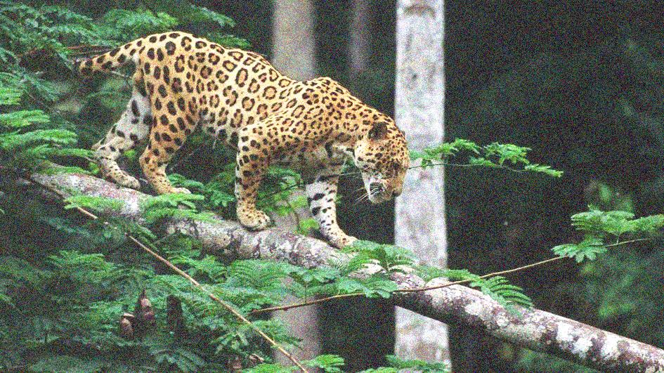
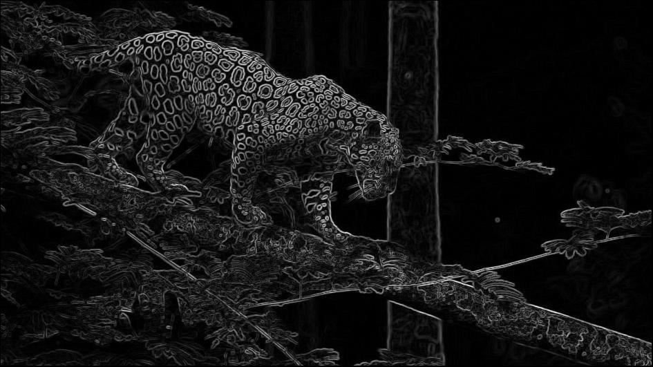

# Computer Vision SBE404B

# Assignment1- Image filtering, processing, edge detection, hybrid images

#####

| Submitted by:            | Sec. | B.N. |
| ------------------------ | ---- | ---- |
| Ashar Seif el Nasr Saleh | 1    | 9    |
| Alaa Allah Essam Abdrabo | 1    | 13   |
| Razan Salah El-said      | 1    | 32   |
| Sohila Mohamed Maher     | 1    | 38   |
| Mariam Ashraf Mohamed    | 2    | 24   |

#Final Submission is on Task_1 jupyter notebook
# 1.Add additive noise to the image

## 1.1 Uniform

- ## Original Image

- ## Uniform noise added to BGR Image

- ## Uniform noise added to Gray Image

## 1.2 Gaussian

- ## Original Image

- ## Gaussian noise added to BGR Image

- ## Gaussian Image added to Gray Image

## 1.3 salt & pepper

- ## Original Image

- ## salt & pepper noise added to BGR Image

- ## salt & pepper noise added to Gray Image

# 2.Filter the noisy image using the following low pass filters

## 2.1 Average

- ## Noisy Image

- ## Filtered Image

## 2.2 Gaussian

- ## Noisy Image

- ## Filtered Image

## 2.3 Median

- ## Noisy Image

- ## Filtered Image

# 3.Detect edges in the image using the following masks

## 3.1 Sobel

- ## Original Image

- ## Sobel_X

- ## Sobel_y

- ## Gradient

## 3.2 Roberts

- ## Original Image

- ## Roberts edge detection

## 3.3 Prewitt

- ## Original Image

- ## Prewitt edge detection

## 3.4 Canny

- ## Original Image

- ## Canny edge detection

# 4.Draw histogram and distribution curve

# 5.Equalize the image.

- ## Original Image

- ## Equalized Image

### Steps:

### 1.Get histogram

### 2.Accumulative Sum

### 3.Normalize this sum from 0 to 255

### 4. Mapping from histogram

# 8. RGB Histo & Distirbution , Convert to GreyScale

- ## Original Image

- ## Grey Scale Image

- ## R G B Histograms

- ## R G B Distribution

# 9. Frequency domain Filters(Low-pass and High-pass filters)

- ## Original Image

- ## Low-pass filtered Image

- ## high-pass filtered Image

# 10. Hybrid image

