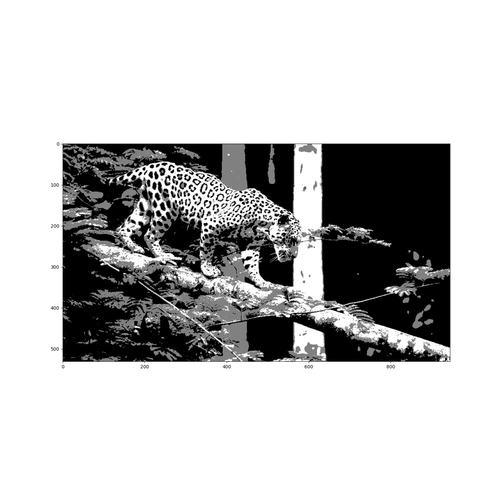

# Computer Vision SBE404B

# Assignment_4 "Image Segmentation"

#####

| Submitted by:            | Sec. | B.N. | E-mail                      |
| ------------------------ | ---- | ---- | --------------------------- |
| Ashar Seif el Nasr Saleh | 1    | 9    | asharzanqour@gmail.com      |
| Alaa Allah Essam Abdrabo | 1    | 13   | alaaessammirah@gmail.com    |
| Razan Salah El-sayed     | 1    | 32   | razansalah022@gmail.com     |
| Sohila Mohamed Maher     | 1    | 38   | sohilamohamed583@gmail.com  |
| Mariam Ashraf Mohamed    | 2    | 24   | mariamashraf731@outlook.com |

# 1. Code Architecture

# 1.1 Global Thresholding

# 1.1.a Optimal Thresholding

- Optimal thresholding works with greyscale image and sub this image to a Background component and a foreground component according to the the threshold then get the optimal threshold :

1- Read a greyscale Image

2- Get histogram of the tottal image and get the optimal threshold for this

```python
#histogram of the img
im, bins = np.histogram(grayimg, range(257))
#get the optimal threshold for all img with 200
optimalthreshold = getOptimmalThreshold(im, 200)
```

3- apply optimal threshold algorithm:

```python
def getOptimmalThreshold(im, threshold):
    # devide image into two sections "Background & foreGround"
    # im, bins = np.histogram(im, range(257))
    back = im[:threshold]
    fore = im[threshold:]
    # Compute the centroids or Mean
    mBack = (back*np.arange(0, threshold)).sum()/back.sum()
    mFore = (fore*np.arange(threshold, len(im))).sum()/fore.sum()
    # New threshold
    NewThreshold = int(np.round((mBack+mFore)/2))
    print(mBack, mFore, NewThreshold)
    # Recursion with the newthreshold till the threshold is the same "const"
    if(NewThreshold != threshold):
        return getOptimmalThreshold(im, NewThreshold)
    return NewThreshold
```

4- Map the newthreshold with image so it will result an black and white segmented object

```python
#Map threshold with the original image
segImg = grayimg > optimalthreshold
```

# 1.1.b Ostu Thresholding

- Otsu function processes image histogram, segmenting the objects by minimization of the variance on each of the classes by minimization of the variance on each of the classes.This function is divided into multiple steps :

1- Convert to grayscale then get pixels values probabilities using histogram and the sum of probabilities of all pixels values

```python
def otsuThresholding(img):
    if len(img.shape) > 2:
        grayImage = grayScale.grayImg(img)
    else:
        pass
    yWindowSize, xWindowSize = grayImage.shape
    HistValues = plt.hist(grayImage.ravel(), 256)
    total_pixels = xWindowSize*yWindowSize
    current_max, threshold = 0, 0
    sumT, sumF, sumB = 0, 0, 0
    for i in range(0, 256):
        sumT += i * HistValues[0][i]
    weightB, weightF = 0, 0
    varBetween, meanB, meanF = 0, 0, 0
```

1.1- The histogram function was implemented in task 0 as shown next :

```python
def histogram(image):
    h, w = image.shape
    grayscale_array = []
    for px in range(0, h):
        for py in range(0, w):
            intensity = image[px][py]
            grayscale_array.append(intensity)
    bins = range(0, 255)
    img_histogram = np.histogram(grayscale_array, bins)
    return img_histogram
```

2-Iterating on all pixels' values to get the best threshold then check if the pixels values represented in one value.

```python
 for i in range(0, 256):
        weightB += HistValues[0][i]
        weightF = total_pixels - weightB
        if weightF == 0:
            break
        sumB += i*HistValues[0][i]
        sumF = sumT - sumB
        meanB = sumB/weightB
        meanF = sumF/weightF
        varBetween = weightB * weightF
        varBetween *= (meanB-meanF)*(meanB-meanF)
        if varBetween > current_max:
            current_max = varBetween
            threshold = i
```

3-Sending image to global thresholding function with the new threshold.

```python
 ostu_image = Global_thresholding(grayImage, threshold)

 def Global_thresholding(image, threshold):
    h, w = np.shape(image)
    # pixel threshold
    for px in range(0, h):
        for py in range(0, w):
            intensity = image[px][py]
            if (intensity <= threshold):
                intensity = 0
            else:
                intensity = 255
            image[px][py] = intensity

    return image

```

# 1.1.c Spectral Thresholding

- Spectral Thresholding is a process that segments a gray level image into several distinct regions.That is done by several steps
  1- Get The Values of The Histogram Bins then Calculate The Probability Density Function then Calculate The Cumulative Density Function

```python
 def spectralThresholding(img):

    grayImage = np.copy(img)
    if len(img.shape) > 2:
        grayImage = grayScale.grayImg(grayImage)
    else:
        pass
    # Get Image Dimensions
    yWindowSize, xWindowSize = grayImage.shape
    # Get The Values of The Histogram Bins
    HistValues = plt.hist(grayImage .ravel(), 256)[0]
    # Calculate The Probability Density Function
    PDF = HistValues / (yWindowSize * xWindowSize)
    # Calculate The Cumulative Density Function then
    CDF = np.cumsum(PDF)
```

2- Loop Over All Possible Thresholds, Select One With Maximum Variance Between Background & The Object (Foreground)

```python
 def spectralThresholding(img):

    grayImage = np.copy(img)
    if len(img.shape) > 2:
        grayImage = grayScale.grayImg(grayImage)
    else:
        pass
    # Get Image Dimensions
    yWindowSize, xWindowSize = grayImage.shape
    # Get The Values of The Histogram Bins
    HistValues = plt.hist(grayImage .ravel(), 256)[0]
    # Calculate The Probability Density Function
    PDF = HistValues / (yWindowSize * xWindowSize)
    # Calculate The Cumulative Density Function
    CDF = np.cumsum(PDF)
```

3- Calculate Mean of Background & The Object (Foreground), Based on CDF & PDF then Calculate Cross-Class Variance and Filter Out Max Variance & It's Threshold

```python
   BackMean = sum(Back * PDF[0:LowT]) / CDF[LowT]
            LowMean = sum(Low * PDF[LowT:HighT]) / CDFL
            HighMean = sum(High * PDF[HighT:256]) / CDFH
            # Calculate Cross-Class Variance
            Variance = (CDF[LowT] * (BackMean - GMean) ** 2 + (CDFL * (LowMean - GMean) ** 2) + (
                CDFH * (HighMean - GMean) ** 2))
            # Filter Out Max Variance & It's Threshold
            if Variance > MaxVariance:
                MaxVariance = Variance
                OptimalLow = LowT
                OptimalHigh = HighT
```

4-Apply Double Thresholding To Image to get the Lowest Allowed Value using Low Threshold Ratio/Intensity and the Minimum Value To Be Boosted using High Threshold Ratio/Intensity.

```python
   # Create Empty Array
    ThresholdedImage = np.zeros(grayImage.shape)

    HighPixel = 255
    LowPixel = 128

    # Find Position of Strong & Weak Pixels
    HighRow,  HighCol = np.where(grayImage >= OptimalHigh)
    LowRow, LowCol = np.where(
        (grayImage <= OptimalHigh) & (grayImage >= OptimalLow))

    # Apply Thresholding
    ThresholdedImage[HighRow, HighCol] = HighPixel
    ThresholdedImage[LowRow, LowCol] = LowPixel

    return ThresholdedImage
```

# 1.2 Local Thresholding

- We use the same function for different types of thresholding , this function takes the image , number of windows in both directions x and y and the thresholding option we want to apply , It divided the image into sub regions (windows) according to the user parameters then apply the option global thresholing for each subimage.

```python
def localThresholding(img, nx, ny, thresholdingOption):

    grayImage = np.copy(img)

    if len(img.shape) > 2:
        grayImage = grayScale.grayImg(grayImage)
    else:
        pass

    YMax, XMax = grayImage.shape
    subImage = np.zeros((YMax, XMax))
    yWindowSize = YMax // ny
    xWindowSize = XMax // nx
    xWindow = []
    yWindow = []
    for i in range(0, nx):
        xWindow.append(xWindowSize * i)

    for i in range(0, ny):
        yWindow.append(yWindowSize * i)

    xWindow.append(XMax)
    yWindow.append(YMax)
    for x in range(0, nx):
        for y in range(0, ny):
            subImage[yWindow[y]:yWindow[y + 1], xWindow[x]:xWindow[x + 1]] = thresholdingOption(
                grayImage[yWindow[y]:yWindow[y + 1], xWindow[x]:xWindow[x + 1]])
    return subImage
```

# 2.a Map RGB to LUV

# 2.b.1 k-means

- Initializes some K number of centroids for the clustering

```
	for k in range(0, someK):

		cent = px[np.random.randint(0, img_width), np.random.randint(0, img_height)]
		centroids.append(cent)
```

- Make the current centroids into the old centroids
- Assign each pixel in the image to their respective centroids
- Adjust the centroids to the center of their assigned pixels

```
    old_centroids = centroids
    clusters = assignPixels(centroids)
    centroids = adjustCentroids(old_centroids, clusters)
```

- Assigns each pixel to the given centroids for the algorithm.

```

    def assignPixels(centroids):
        clusters = {}

        for x in range(0, img_width):
            for y in range(0, img_height):
                p = px[x, y]
                minIndex = getMin(px[x, y], centroids)

                try:
                    clusters[minIndex].append(p)
                except KeyError:
                    clusters[minIndex] = [p]

        return clusters

```

- GetMin

Method used to find the closest centroid to the given pixel.

```
def getMin(pixel, centroids):
	minDist = 9999
	minIndex = 0

	for i in range(0, len(centroids)):
		d = np.sqrt(int((centroids[i][0] - pixel[0]))**2 + int((centroids[i][1] - pixel[1]))**2 + int((centroids[i][2] - pixel[2]))**2)
		if d < minDist:
			minDist = d
			minIndex = i

	return minIndex
```

- AdjustCentroids

Method is used to re-center the centroids according to the pixels assigned to each. A mean average is applied to each cluster's RGB values, which is then set as the new centroids.

```
def adjustCentroids(centroids, clusters):
	new_centroids = []
	keys = sorted(clusters.keys())

	for k in keys:
		n = np.mean(clusters[k], axis=0)
		new = (int(n[0]), int(n[1]), int(n[2]))
		print(str(k) + ": " + str(new))
		new_centroids.append(new)

	return new_centroids
```

- Converged

Will determine if the centroids have converged or not.Essentially, if the current centroids and the old centroids are virtually the same, then there is convergence.

```
def converged(centroids, old_centroids):
	if len(old_centroids) == 0:
		return False


	if len(centroids) <= 5:
		a = 1
	elif len(centroids) <= 10:
		a = 2
	else:
		a = 4

	for i in range(0, len(centroids)):
		cent = centroids[i]
		old_cent = old_centroids[i]

		if ((int(old_cent[0]) - a) <= cent[0] <= (int(old_cent[0]) + a)) and ((int(old_cent[1]) - a) <= cent[1] <= (int(old_cent[1]) + a)) and ((int(old_cent[2]) - a) <= cent[2] <= (int(old_cent[2]) + a)):
			continue
		else:
			return False

	return True
```

# 2.b.2 Region Growing

## Major steps of the algorithm :

- Selection of the initial seeds
- Seed growing criteria
- Termination of the segmentation process(condition)

## 1. Start with a seed region.

- we choosed 3 random points

```
seed_points = []
    for i in range(3):
        x = np.random.randint(0, img.shape[0])
        y = np.random.randint(0, img.shape[1])
        seed_points.append(Point(x, y))
```

## 2. Seed growing criteria

- Getting 8 neighbour points to the current seed

```
def selectConnects(p):
    if p != 0:
        connects = [Point(-1, -1), Point(0, -1), Point(1, -1),
                    Point(1, 0), Point(1, 1), Point(0, 1),
                    Point(-1, 1), Point(-1, 0)]
    else:
        connects = [Point(0, -1), Point(1, 0), Point(0, 1), Point(-1, 0)]

    return connects
```

- Substract pixels values from the seed point then verify wit hthe threshold.

```
def getGrayDiff(img, currentPoint, tmpPoint):
    return abs(int(img[currentPoint.x, currentPoint.y]) - int(img[tmpPoint.x, tmpPoint.y]))
```

- Threshold of 10 (The threshold is subject dependent. )

```

binaryImg = Region_growing(img_gray, seed_points, 10)

```

## 3. Grow region by merging neighbouring pixels.

### The seed pixel and the pixels in the surrounding neighborhood that have the same or similar properties as the seed pixel are merged into the region where the seed pixel is located.

### These new pixels are treated as new seeds to continue the above process until pixels that do not meet the conditions can be included

```
 if grayDiff < thresh and seedMark[tmpX, tmpY] == 0:
                seedMark[tmpX, tmpY] = label
                seedList.append(Point(tmpX, tmpY))
```

# 2.b.3 Agglomerative
Feature space is given by the luv pixel values.
## Steps:
1) Each data point is assigned as a single cluster.
2) Determine the distance measurement and calculate the distance matrix
3) find the closest (most similar) pair of clusters and merge them 
```python 
cluster1, cluster2 = min([(c1, c2) for i, c1 in enumerate(self.clusters_list) for c2 in self.clusters_list[:i]],
                 key=lambda c: clusters_distance_2(c[0], c[1]))

merged_cluster = cluster1 + cluster2
```
4) Repeat until specified number of clusters is obtained  .


# 2.b. Mean shift

Feature space is given by the luv pixel values and resized image to 50X50 to reduce time although this gives low quality image but the output for image without resizing was also obtained and is shown in results section.
## Steps:
1) Pick any random point(selected first point in feature space everytime for simplicity), and place the window on that data point (selecetd window of radius 30)

```python
 while len(self.data) > 0:
            centroid = self.data[0]
```
2) Calculate the mean of all the points lying inside this window

```python 
 while True:
    points_within_radius = []

    for feature in self.data:
        if (np.linalg.norm(feature-centroid) <= self.radius).all() :
            points_within_radius.append(feature)

    indices_within_radius=np.array([i for i, b in enumerate(originaldata) for s in points_within_radius if all(s == b)])
    indices_within_radius=np.unique(indices_within_radius,axis=0)
#save old centroid
    old_centroid = centroid    
#update new centroid
    if (len(points_within_radius) > 0):
        centroid = np.mean(points_within_radius, axis=0)
```
3) Repeat till convergence ,convergence is achieved if the centroid becomes almost stable (selected a threshold of 0.1 for stability )
```python
#check convergence
    if self.euclidean_distance(old_centroid, centroid) < 0.1:
        break

self.centroids.append(centroid)
self.clusters.append(indices_within_radius)

data_cpy=self.data.copy()
self.data=np.array([i for i in data_cpy if not (i==points_within_radius).all(1).any()])
```

# 1. Libraries Versions

#### Python 3.7.2

#### OpenCv 4.5.5

#### Numpy 1.20.3

#### Matplotlib 3.5.1

# Results

### 1.1 General Thresholding

### 1.1.a Optimal Thresholding

|      Solarized dark       |          Solarized Ocean          |
| :-----------------------: | :-------------------------------: |
|  |  |

### 1.1.b Ostu Thresholding

The easiest way I can think of solving this is using the tables included in GitHub's flavored markdown.

To your specific example it would look something like this:

|        Original Image         |        Global Otsu Thresholding        |
| :---------------------------: | :------------------------------------: |
|       |       |
|  |  |

### 1.1.c Spectral Thresholding

|        Original Image         |        Global Spectral Thresholding        |
| :---------------------------: | :----------------------------------------: |
|  |       |
|  |  |

### 1.2 Local Thresholding

### 1.2.a Optimal Thresholding

|      Solarized dark       |         Solarized Ocean          |
| :-----------------------: | :------------------------------: |
|  |  |

### 1.2.b Ostu Thresholding

|        Original Image         |           Local Otsu Thresholding           |
| :---------------------------: | :-----------------------------------------: |
|  |  |
|  |  |

### 1.2.c Spectral Thresholding

|        Original Image         |           Local Spectral Thresholding           |
| :---------------------------: | :---------------------------------------------: |
|  |        |
|  |  |

# 2.a Map RGB to LUV

# 2.b.1 k-means

|    Before Segmentation     |         After Segmentation          |
| :------------------------: | :---------------------------------: |
|  |  |

# 2.b.2 Region Growing

|   Before Segmentation   |         After Segmentation          |
| :---------------------: | :---------------------------------: |
|  |  |

# 2.b.3 Agglomerative

|    Before Segmentation     |         After Segmentation          |
| :------------------------: | :---------------------------------: |
|  |  |

# 2.b. Mean shift
|    Before Segmentation     |         After Segmentation          |
| :------------------------: | :---------------------------------: |
|  |  |

# Discussion

-
-

-
-
